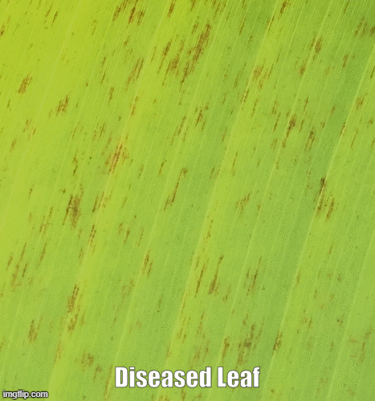

# SigatokaDetection

Sigatoka is a disease found in banana leaves. In this project, I used image processing techniques to look for diseased spots in banana leaves. 
Todo: CLassify Leaves based on severity level of Sigatoka.

